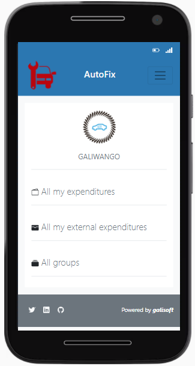

# AutoFix

AutoFix is a RESTful mobile application created using Ruby on rails to aid with tracking expenses on auto mobile maintenance. This application allows  the user to classify the expenses in a group, based on the repair or maintenance that has been done. The original concept was designed by Gregoire Vella on Behance.
Below is a screenshot of the home page of a signed in user.

## Home page of a logged in user.



## Built With
- Ruby v2.7.2
- Ruby on Rails v6.1.3
- HTML, CSS
- Bootstrap
- Postgres 13.1

## Live Demo
[AutoFix live link](https://autofix-exps-tracker.herokuapp.com/)

## Getting Started

To get a local copy up and running follow these simple steps.

### Prerequisites

- Ruby: 2.7.2
- Rails: 6.1.3
- Postgres: >= 13.1

### Clone the repo: 
```
$ git clone https://github.com/gango-anan/autofix.git

```

### Setup

Install the needed gems with:

```
bundle install
```

Setup database with:

```
   rails db:create
   rails db:migrate
```

### Run tests
Finally, run the test suite to verify that everything is working correctly with:
```
    rspec
```

### Usage
If the test suite passes, you'll be ready to run the app in a local server.

Start server with:
```
    rails server
```
### In your browser, type:

```
    http://localhost:3000
```

## Author

GALIWANGO ANANIYA

- GitHub: [@gango-anan](https://github.com/gango-anan) 
- Twitter: [@gango_anan](https://twitter.com/gango_anan) 
- LinkedIn: [@galiwango-ananiya](https://www.linkedin.com/in/galiwango-ananiya-0800821b4/) 

## 🤝 Contributing

Contributions, issues, and feature requests are welcome!

Feel free to check the [issues page](https://github.com/gango-anan/autofix/issues).

## Show your support

Give a ⭐️ if you like this project!

## Acknowledgments
- Gregoire Vella - owner of the application concept( you can find it here (https://www.behance.net/gallery/19759151/Snapscan-iOs-design-and-branding?tracking_source=)
- Credit goes to TheOdinProject.
- Rails guides.
- Standup team.


## 📝 License

This project is [MIT](https://github.com/gango-anan/autofix/blob/master/LICENSE) licensed.
